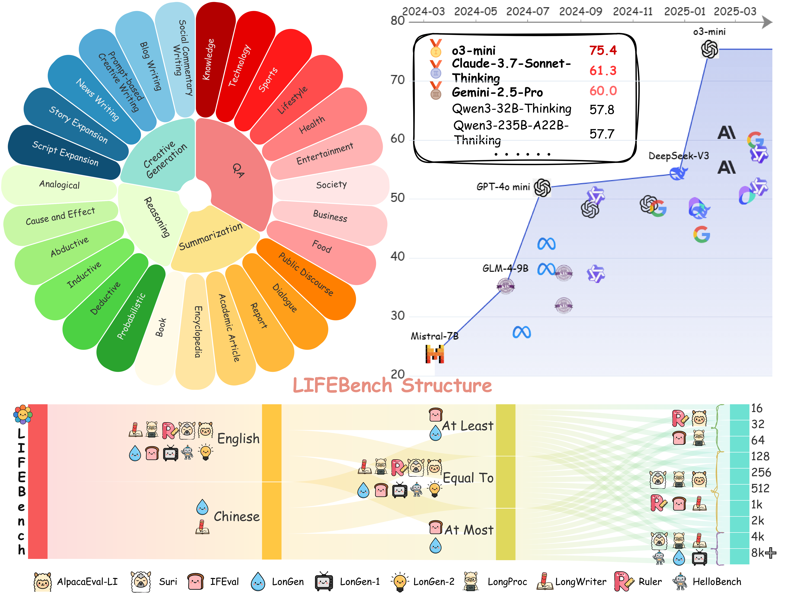

# LIFEBench:  Evaluating Length Instruction Following in Large Language Models
> **📑 Paper**:  The paper will be available soon.

> **🛜 Website**: [https://ydyjya.github.io/LIFEBench/](https://ydyjya.github.io/LIFEBench/).

> **🤗 D**ataset: LIFEBench [https://huggingface.co/datasets/LIFEBench/LIFEBench].

While large language models (LLMs) can solve PhD-level reasoning problems over long context inputs, they still struggle with a seemingly simpler task: following explicit length instructions—*e.g., “write a 10,000-word novel”*. Additionally, models often generate far too short outputs, terminate prematurely, or even refuse the request. Existing benchmarks focus primarily on evaluating the quality, but often overlook whether the generations meet length constraints. To this end, we introduce **Length Instruction Following Evaluation Benchmark** (LIFEBENCH) to comprehensively evaluate LLMs’ ability to follow length instructions across diverse tasks and a wide range of specified lengths. LIFEBENCH consists of 10,800 instances across 4 task categories in both English and Chinese, covering length constraints ranging from 16 to 8192 words. We evaluate 26 widely-used LLMs and find that most models reasonably follow short-length instructions but deteriorate sharply beyond a certain threshold. Surprisingly, almost all models fail to reach the vendor-claimed maximum output lengths in practice, as further confirmed by our evaluations extending up to 32K words. Even long-context LLMs, despite their extended input-output windows, counterintuitively fail to improve length-instructions following. Notably, Reasoning LLMs outperform even specialized long-text generation models, achieving state-of-the-art length following. Overall, LIFEBENCH uncovers fundamental limitations in current LLMs’ length instructions following ability, offering critical insights for future progress. Our benchmarks are available on https://huggingface.co/datasets/LIFEBench/LIFEBench.

 

## Installation

1. Clone this project

```
git clone https://github.com/LIFEBench/LIFEBench.git
cd LIFEBench
```

2. Create virtual environment

```
conda create -n LIFEBench python=3.9 -y
conda activate LIFEBench
```

3. Install requirements

```
pip install -r requirements.txt
```

4. Create a new `model_key_config.yaml` in the exp directory

```
cd exp
touch model_key_config.yaml
```

5. Please enter the key of the model to be tested into the `model_key_config.yaml`

```yaml
gpt-4o-mini:
  api_key: ""  # OpenAI GPT-4o-mini API Key
  base_url: "https://api.openai.com/v1"

gpt-4o:
  api_key: ""  # OpenAI GPT-4o API Key
  base_url: "https://api.openai.com/v1"

o1-mini:
  api_key: ""  # OpenAI o1-mini API Key
  base_url: "https://api.openai.com/v1"

o3-mini:
  azure_endpoint: # Azure OpenAI o3-mini API end_point
  api_key: ""  # Azure OpenAI o3-mini API Key
  api_version: # Azure OpenAI o3-mini API version

claude-3.7-sonnet:
  api_key: ""  # Anthropic Claude 3.7 Sonnet API Key

claude-3.7-sonnet-thinking:
  api_key: ""  # Anthropic Claude 3.7 Sonnet Thinking API Key

gemini-2.0-flash:
  api_key: ""  # Google Gemini 2.0 Flash API Key

gemini-2.0-flash-thinking:
  api_key: ""  # Google Gemini 2.0 Flash Thinking API Key

gemini-2.5-pro:
  api_key: ""  # Google Gemini 2.5 Pro API Key

doubao-1.5-pro:
  api_key: ""  # Doubao 1.5 Pro API Key
  base_url: "https://ark.cn-beijing.volces.com/api/v3/chat/completions"

doubao-1.5-thinking-pro:
  api_key: ""  # Doubao 1.5 Thinking Pro API Key
  base_url: "https://ark.cn-beijing.volces.com/api/v3/chat/completions"

deepseek-r1:
  api_key: ""  # DeepSeek R1 API Key
  base_url: "https://api.deepseek.com"

deepseek-v3:
  api_key: ""  # DeepSeek V3 API Key
  base_url: "https://api.deepseek.com"

Qwen3-235B-A22B:
  api_key: ""  # Qwen3-235B-A22B API Key
  base_url: "https://dashscope.aliyuncs.com/compatible-mode/v1"

Qwen3-235B-A22B-Thinking:
  api_key: ""  # Qwen3-235B-A22B-Thinking API Key
  base_url: "https://dashscope.aliyuncs.com/compatible-mode/v1"

Qwen3-32B:
  api_key: ""  # Qwen3-32B API Key
  base_url: "https://dashscope.aliyuncs.com/compatible-mode/v1"

Qwen3-32B-Thinking:
  api_key: ""  # Qwen3-32B-Thinking API Key
  base_url: "https://dashscope.aliyuncs.com/compatible-mode/v1"
```

6. Modify `exp/model_param_config.yaml` and replace all model names and paths with your own as appropriate.

```yaml
gpt-4o-mini:
  model: "gpt-4o-mini-2024-07-18"          # Model name for OpenAI GPT-4o-mini; replace with your own if needed
  max_completion_tokens: 16384              # Maximum number of tokens the model can generate
  temperature: 0.8                          # Sampling temperature; higher means more random output
  top_p: 1                                  # Nucleus sampling probability; 1 means no cutoff

gpt-4o:
  model: "gpt-4o-2024-11-20"                # Model name for OpenAI GPT-4o; replace as needed
  max_completion_tokens: 16384
  temperature: 0.8
  top_p: 1

o1-mini:
  model: "o1-mini-2024-09-12"               # Model name for OpenAI o1-mini
  max_completion_tokens: 65536

o3-mini:
  model: "o3-mini-2024-12-01-preview"       # Model name for Azure OpenAI o3-mini
  max_completion_tokens: 65536
  reasoning_effort: "medium"                # Reasoning effort level: low, medium, or high

claude-3.7-sonnet:
  model: "claude-3-7-sonnet-20250219"       # Model name for Anthropic Claude 3.7 Sonnet
  max_tokens: 64000                         
  temperature: 0.8
  top_p: 1

claude-3.7-sonnet-thinking:
  model: "claude-3-7-sonnet-20250219"
  max_tokens: 64000
  thinking: {"type": "enabled"}             # Enable Claude's "thinking" feature

gemini-2.0-flash:
  model: "gemini-2.0-flash"                 # Model name for Google Gemini 2.0 Flash
  max_output_tokens: 8192
  temperature: 0.8
  top_p: 1
  response_mime_type: "text/plain"          # Response content type; usually keep as is

gemini-2.0-flash-thinking:
  model: "gemini-2.0-flash-thinking-exp-01-21"
  max_output_tokens: 65536
  temperature: 0.8
  top_p: 1
  response_mime_type: "text/plain"

gemini-2.5-pro:
  model: "gemini-2.5-pro-preview-03-25"
  max_output_tokens: 65536
  temperature: 0.8
  top_p: 1
  response_mime_type: "text/plain"

doubao-1.5-pro:
  model: "doubao-1-5-pro-32k-250115"        # Model name for Doubao 1.5 Pro
  max_tokens: 16384
  temperature: 0.8
  top_p: 1

doubao-1.5-thinking-pro:
  model: "doubao-1-5-thinking-pro-250415"
  max_tokens: 16384
  reasoning_effort: "medium"

deepseek-r1:
  model: "deepseek-reasoner"                # Model name for DeepSeek R1
  max_completion_tokens: 8192
  reasoning_effort: "medium"

deepseek-v3:
  model: "deepseek-chat"                    # Model name for DeepSeek Chat v3
  max_completion_tokens: 8192
  temperature: 0.8
  top_p: 1

Llama-3.1-8B-Instruct:
  model: "../../model/Llama/Meta-Llama-3.1-8B-Instruct"  # Local path to Meta Llama 3.1 8B Instruct
  max_length: 131072
  temperature: 0.8
  top_p: 1
  do_sample: True

Llama-3.1-70B-Instruct:
  model: "../../model/Llama/Llama-3.1-70B-Instruct"      # Local path to Llama 3.1 70B Instruct
  max_length: 131072
  temperature: 0.8
  top_p: 1
  do_sample: True

Qwen3-235B-A22B:
  model: "qwen3-235b-a22b"                # Model name for Qwen3-235B-A22B
  temperature: 0.8
  top_p: 1
  max_completion_tokens: 8192
  extra_body: {"enable_thinking": False}  # Whether to enable "thinking" mode; set to True/False
  stream: True                            # Whether to enable streaming output

Qwen3-235B-A22B-Thinking:
  model: "qwen3-235b-a22b"
  max_completion_tokens: 8192
  extra_body: {"enable_thinking": True}
  stream: True

Qwen3-32B:
  model: "qwen3-32b"                      # Model name for Qwen3-32B
  max_completion_tokens: 16384
  top_p: 1
  extra_body: {"enable_thinking": False}
  temperature: 0.8
  stream: True

Qwen3-32B-Thinking:
  model: "qwen3-32b"
  max_completion_tokens: 16384
  extra_body: {"enable_thinking": True}
  stream: True

Qwen2.5-7B-Instruct:
  model: "../../model/Qwen/Qwen2.5-7B-Instruct"  # Local path to Qwen2.5-7B-Instruct model
  max_new_tokens: 8192
  temperature: 0.8
  top_p: 1
  do_sample: True

Qwen2.5-72B-Instruct:
  model: "../../model/Qwen/Qwen2.5-72B-Instruct"  # Local path to Qwen2.5-72B-Instruct model
  max_new_tokens: 8192
  temperature: 0.8
  top_p: 1
  do_sample: True

glm-4-9b:
  model: "../../model/THUDM/glm-4-9b-chat"       # Local path to GLM-4-9B chat model
  max_new_tokens: 65536
  temperature: 0.8
  top_p: 1
  do_sample: True

Mistral-7B-Instruct:
  model: "../../model/mistralai/Mistral-7B-Instruct-v0.2"  # Local path to Mistral-7B-Instruct model
  max_length: 32768
  temperature: 0.8
  top_p: 1
  do_sample: True

LongWriter-glm4-9b:
  model: "../../model/THUDM/LongWriter-glm4-9b"            # Local path to LongWriter GLM4-9B model
  max_new_tokens: 65536
  temperature: 0.8
  top_p: 1
  do_sample: True

LongWriter-llama3.1-8b:
  model: "../../model/THUDM/LongWriter-llama3.1-8b"        # Local path to LongWriter Llama3.1-8B model
  max_new_tokens: 65536
  temperature: 0.8
  top_p: 1
  do_sample: True

suri-i-orpo:
  model: "../../model/mistralai/Mistral-7B-Instruct-v0.2"  # Base model path for Suri-i-ORPO
  finetuned_model: "../../model/Suri/suri-i-orpo"          # Path to Suri-i-ORPO finetuned weights
  max_length: 32768
  temperature: 0.8
  top_p: 1
  do_sample: True
```


## Run Experiment

You can run the experiment script directly, or customize its behavior by passing parameters. By default, the script uses the following settings:

### **Default Usage**

Simply run:

```bash
python run_exp.py
```

This will use all default parameter values:

- **Meta data file:** `./data/data.jsonl`
- **Output directory:** `./result`
- **Model type:** `GPT_4o_mini`
- **Length constraints:** `[16, 32, 64, 128, 256, 512, 1024, 2048, 4096, 8192]`
- **Control methods:** `["equal to"]`
- **Model parameter config:** `./exp/model_param_config.yaml`
- **Model key config:** `./exp/model_key_config.yaml`

------

### **Custom Usage**

You can override any parameter from the command line. For example:

```bash
python run_exp.py \
  --model_type Qwen3_32B \
  --length_constraints 128 256 512 \
  --control_methods "equal to" "at most" \
  --meta_data_path /path/to/your/data.jsonl \
  --output_file_dir /tmp/result \
  --param_config_file ./your_param_config.yaml \
  --key_config_file ./your_key_config.yaml
```

------

### **All Parameters**

| Argument               | Description                                              | Default                         |
| ---------------------- | -------------------------------------------------------- | ------------------------------- |
| `--meta_data_path`     | Path to the meta data file                               | `./data/data.jsonl`             |
| `--output_file_dir`    | Directory to save output files                           | `./result`                      |
| `--model_type`         | Model type to use (see list below)                       | `GPT_4o_mini`                   |
| `--length_constraints` | List of length constraints (e.g. 128 256 512)            | `[16, 32, 64, ..., 8192]`       |
| `--control_methods`    | Control methods: `"equal to"`, `"at most"`, `"at least"` | `["equal to"]`                  |
| `--param_config_file`  | Path to model parameter config file                      | `./exp/model_param_config.yaml` |
| `--key_config_file`    | Path to model key config file                            | `./exp/model_key_config.yaml`   |

**Supported `--model_type` values:**
 `GPT_4o_mini`, `GPT_4o`, `o1_mini`, `o3_mini`, `Claude_37_sonnet`, `Claude_37_sonnet_thinking`, `Gemini_2_flash`, `Gemini_2_flash_thinking`, `Gemini_25_pro`, `Doubao_15_pro`, `Doubao_15_thinking_pro`, `Deepseek_V3`, `Deepseek_R1`, `Llama31_8B`, `Llama31_70B`, `Qwen3_235B`, `Qwen3_235B_Thinking`, `Qwen3_32B`, `Qwen3_32B_Thinking`, `Qwen25_7B`, `Qwen25_72B`, `GLM4_9B`, `Mistral_7B`, `LongWriter_GLM4_9B`, `LongWriter_Llama31_8B`, `Suri`

------

### **Show All Options**

To see all available options and help text, run:

```bash
python run_exp.py --help
```

---

## Run Evaluation

After your experiment has finished, you can evaluate the results using the `evaluate.py` script.

### **Default Usage**

Simply run:

```bash
python evaluate.py
```

This command will:

- Use the directory `./result` as the input data to be evaluated.
- Save the evaluation results to `./evaluate_result`.

------

### **Custom Usage**

You can specify your own input and output directories with command-line arguments:

```bash
python evaluate.py \
  --data_dir /path/to/result_directory \
  --output_dir /path/to/evaluate_result_directory
```

- `--data_dir`: Directory containing the data to be evaluated.
   **Default:** `./result`
- `--output_dir`: Directory to save the evaluation results.
   **Default:** `./evaluate_result`

------

### **All Parameters**

| Argument       | Description                               | Default             |
| -------------- | ----------------------------------------- | ------------------- |
| `--data_dir`   | Directory containing data to be evaluated | `./result`          |
| `--output_dir` | Directory to save evaluation results      | `./evaluate_result` |

------

### **Output**

After running the script, you’ll see:

```
Evaluation completed. Results have been saved to: ./evaluate_result
```

or (if you used custom output):

```
Evaluation completed. Results have been saved to: /your/output/path
```

------

> **Tip:**
>  Make sure the experiment results you want to evaluate are in the correct input directory before running the evaluation script.

---

